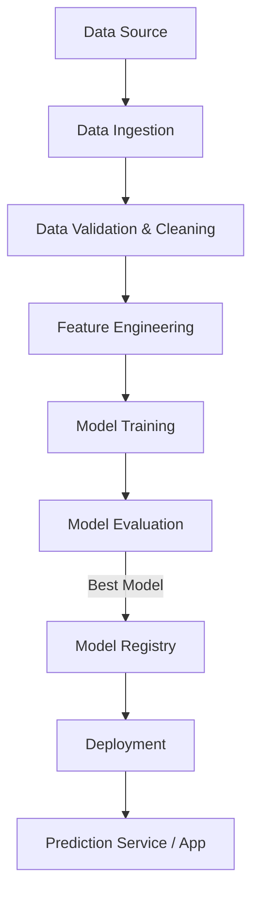

# End-to-End Machine Learning Project

This repository demonstrates the complete workflow of building, training, evaluating, and deploying a Machine Learning model in a production-ready manner.  

The project follows MLOps best practices with modular code, reproducible experiments, and scalable deployment strategies.

---

## 🚀 Features
- Data ingestion and validation pipeline  
- Exploratory Data Analysis (EDA)  
- Feature engineering and preprocessing  
- Model training with multiple algorithms  
- Model evaluation and selection  
- MLflow experiment tracking  
- Model packaging and deployment (Docker/Streamlit/FastAPI)  
- CI/CD friendly structure  

---

## 📂 Project Structure
```
end-to-end-ML_project/
│
├── data/ # Raw and processed data
│ ├── raw/
│ └── processed/
│
├── notebooks/ # Jupyter notebooks for experiments & EDA
│
├── src/ # Source code for ML pipeline
│ ├── data_ingestion.py
│ ├── data_preprocessing.py
│ ├── train.py
│ ├── evaluate.py
│ ├── predict.py
│ └── utils/
│
├── models/ # Saved models
│
├── configs/ # Config files (YAML/JSON)
│
├── tests/ # Unit tests
│
├── requirements.txt # Dependencies
├── Dockerfile # For containerization
├── app.py # Streamlit / FastAPI app for inference
└── README.md # Project documentation
```

---

## 🔄 Workflow



## ⚙️ Setup Instructions

### 1. Clone the repository
```
git clone https://github.com/Naveen-DS08/end-to-end-ML_project.git
cd end-to-end-ML_project
```

### 2. Create virtual environment & install dependencies
```
python -m venv venv
source venv/bin/activate   # On Linux/Mac
venv\Scripts\activate      # On Windows

pip install -r requirements.txt
```

### 3. Run training pipeline
```
Run training pipeline
```

### 4. Serve model with Streamlit / FastAPI
```
streamlit run app.py
# or
uvicorn app:app --reload

```

## 📊 Results

- Model performance metrics (Accuracy, Precision, Recall, F1, AUC)

- Visualizations from EDA and feature importance

## 🛠️ Tech Stack

- Python

- Scikit-learn / PyTorch / TensorFlow (depending on your model)

- Pandas, NumPy, Matplotlib, Seaborn

- MLflow / DVC / Airflow (optional)

- Streamlit / FastAPI for deployment

- Docker for containerization

## 📌 Future Improvements

- Add CI/CD with GitHub Actions

- Integrate cloud deployment (AWS/GCP/Azure)

- Add monitoring & model drift detection

## 👨‍💻 Author

**Naveen Babu S**
